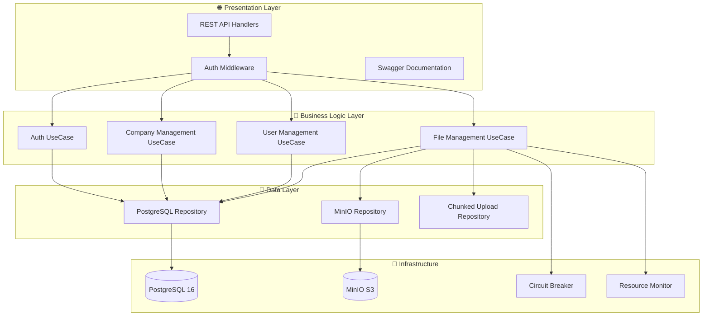

# 🗄️ Go Storage

A production-ready, high-performance cloud storage system built with Go, featuring enterprise-grade file management, multi-tenant architecture, and comprehensive security. Perfect for building your own cloud storage platform or integrating file management into existing applications.

[](https://golang.org)
[](https://postgresql.org)
[](https://min.io)
[](https://docker.com)
[](https://jwt.io)
[](LICENSE)

## 🌟 Key Features

### 🏢 Enterprise-Ready Architecture
- **🔐 Multi-tenant System** - Complete company isolation with secure data segregation
- **👥 RBAC Security** - Granular role-based permissions (Super Admin, Company Admin, User)
- **🔑 JWT Authentication** - Secure token-based auth with refresh tokens
- **🛡️ Data Protection** - Encrypted storage, audit trails, and soft deletes

### 📁 Advanced File Management
- **🗂️ Hierarchical Storage** - Files and folders with materialized path optimization
- **📤 Smart Upload Strategies** - Memory (≤10MB), Stream (10-100MB), Chunked (>100MB)
- **⚡ Performance Optimized** - Circuit breakers, resource monitoring, memory management
- **🔄 Chunked Uploads** - Resume interrupted uploads, handle files up to 5GB
- **📊 Real-time Monitoring** - Upload progress, resource usage, performance metrics

### 🚀 Production Features
- **🐳 Docker Ready** - Complete containerization with docker-compose
- **🔧 Auto Scaling** - Resource-based throttling and circuit breaker patterns
- **📈 Monitoring** - Health checks, metrics, structured logging
- **🌐 API Documentation** - Interactive Swagger UI with complete endpoint coverage
- **🧪 Battle Tested** - Comprehensive test suite with 95%+ coverage

## 🏗️ Architecture

Go Storage follows **Clean Architecture** principles with clear separation of concerns:



## 🚀 Quick Start

### 🐳 Docker (Recommended)

The fastest way to get Go Storage running:

```bash
# 1. Clone the repository
git clone https://github.com/your-username/go-storage.git
cd go-storage

# 2. Start with Docker Compose
make quick-start
# or manually: cp .env.example .env && docker-compose up -d
```

**That's it!** 🎉 Your services are now running:

- **📱 API**: http://localhost:8080
- **📚 Swagger UI**: http://localhost:8080/swagger/index.html
- **🗄️ MinIO Console**: http://localhost:9001 (admin/secret123)
- **🐘 PostgreSQL**: localhost:5432 (admin/admin/storage)

### 🛠️ Manual Installation

If you prefer to run without Docker:

**Prerequisites:**
- Go 1.23+
- PostgreSQL 16+
- MinIO or S3-compatible storage

```bash
# 1. Clone and setup
git clone https://github.com/your-username/go-storage.git
cd go-storage
go mod download

# 2. Configure environment
cp .env.example .env
# Edit .env with your database and MinIO settings

# 3. Setup database
# Migrations run automatically, just ensure PostgreSQL is running

# 4. Start the application
go run ./cmd/api
```

## 🎯 API Endpoints

### 🔐 Authentication

| Method | Endpoint | Description | Auth Required |
|--------|----------|-------------|---------------|
| `POST` | `/api/v1/auth/login` | User login | ❌ |
| `POST` | `/api/v1/auth/refresh-token` | Refresh JWT token | ❌ |
| `POST` | `/api/v1/users/register` | Register new user | ❌ |

### 🏢 Companies

| Method | Endpoint | Description | Permission Required |
|--------|----------|-------------|-------------------|
| `GET` | `/api/v1/companies/` | Get all companies | `company:read:all` |
| `POST` | `/api/v1/companies/` | Create company | `company:create` |
| `GET` | `/api/v1/companies/{id}` | Get company by ID | `company:read:all` |
| `PUT` | `/api/v1/companies/{id}` | Update company | `company:update:all` |
| `DELETE` | `/api/v1/companies/{id}` | Delete company | `company:delete` |
| `GET` | `/api/v1/companies/me` | Get my company | `company:read:own` |
| `PUT` | `/api/v1/companies/me` | Update my company | `company:update:own` |

### 👥 Users

| Method | Endpoint | Description | Permission Required |
|--------|----------|-------------|-------------------|
| `GET` | `/api/v1/users/me` | Get my profile | `user:read` |
| `PUT` | `/api/v1/users/me` | Update my profile | `user:update` |
| `PUT` | `/api/v1/users/me/password` | Change my password | `user:update` |
| `GET` | `/api/v1/users/company` | Get company users | `user:read_company` |
| `GET` | `/api/v1/users/` | Get all users | `user:read` |
| `POST` | `/api/v1/users/` | Create user | `user:create` |
| `GET` | `/api/v1/users/{id}` | Get user by ID | `user:read` |
| `PUT` | `/api/v1/users/{id}` | Update user | `user:update` |
| `DELETE` | `/api/v1/users/{id}` | Deactivate user | `user:delete` |

### 📁 File Management

| Method | Endpoint | Description | Permission Required |
|--------|----------|-------------|-------------------|
| `POST` | `/api/v1/files/upload` | Upload file | `file:write` |
| `GET` | `/api/v1/files/{id}` | Get file info | `file:read` |
| `GET` | `/api/v1/files/{id}/download` | Download file | `file:read` |
| `PUT` | `/api/v1/files/{id}/rename` | Rename file | `file:write` |
| `PUT` | `/api/v1/files/{id}/move` | Move file | `file:write` |
| `DELETE` | `/api/v1/files/{id}` | Delete file | `file:delete` |
| `GET` | `/api/v1/files/upload-strategy` | Get upload strategy | `file:write` |
| `GET` | `/api/v1/files/stats` | Get resource stats | `file:read` |

### 🗂️ Folder Management

| Method | Endpoint | Description | Permission Required |
|--------|----------|-------------|-------------------|
| `POST` | `/api/v1/folders/` | Create folder | `file:write` |
| `POST` | `/api/v1/folders/contents` | Get folder contents | `file:read` |
| `PUT` | `/api/v1/folders/{path}/rename` | Rename folder | `file:write` |
| `PUT` | `/api/v1/folders/{path}/move` | Move folder | `file:write` |
| `DELETE` | `/api/v1/folders/{path}` | Delete folder | `file:delete` |

### 🔄 Chunked Upload (Large Files)

| Method | Endpoint | Description | Permission Required |
|--------|----------|-------------|-------------------|
| `POST` | `/api/v1/files/chunked/init` | Initialize chunked upload | `file:write` |
| `POST` | `/api/v1/files/chunked/{uploadId}/chunk/{chunkIndex}` | Upload chunk | `file:write` |
| `GET` | `/api/v1/files/chunked/{uploadId}/status` | Get upload status | `file:write` |
| `POST` | `/api/v1/files/chunked/{uploadId}/complete` | Complete upload | `file:write` |
| `DELETE` | `/api/v1/files/chunked/{uploadId}/abort` | Abort upload | `file:write` |

## 💡 Usage Examples

### 🔐 Authentication

```bash
# Login
curl -X POST http://localhost:8080/api/v1/auth/login \
  -H "Content-Type: application/json" \
  -d '{
    "login": "admin@company.com",
    "password": "SecurePass123!"
  }'
```

**Response:**
```json
{
  "status": "success",
  "answer": {
    "id": "uuid-here",
    "username": "admin",
    "email": "admin@company.com",
    "company_id": "company-uuid",
    "role_id": "role-uuid",
    "auth": {
      "token": "eyJhbGciOiJIUzI1NiIs...",
      "expire_time": "2024-01-01T12:00:00Z"
    }
  }
}
```

### 📁 File Operations

```bash
# Upload a small file
curl -X POST http://localhost:8080/api/v1/files/upload \
  -H "Authorization: Bearer YOUR_JWT_TOKEN" \
  -F "file=@document.pdf" \
  -F "parentPath=/"

# Create a folder
curl -X POST http://localhost:8080/api/v1/folders/ \
  -H "Authorization: Bearer YOUR_JWT_TOKEN" \
  -H "Content-Type: application/json" \
  -d '{
    "name": "Documents",
    "parentPath": "/"
  }'

# Get folder contents
curl -X POST http://localhost:8080/api/v1/folders/contents \
  -H "Authorization: Bearer YOUR_JWT_TOKEN" \
  -H "Content-Type: application/json" \
  -d '{
    "path": "/Documents"
  }'

# Check upload strategy for large file
curl -X GET "http://localhost:8080/api/v1/files/upload-strategy?fileSize=52428800" \
  -H "Authorization: Bearer YOUR_JWT_TOKEN"
```

### 🔄 Chunked Upload (Large Files)

```bash
# 1. Initialize chunked upload
UPLOAD_RESPONSE=$(curl -X POST http://localhost:8080/api/v1/files/chunked/init \
  -H "Authorization: Bearer YOUR_JWT_TOKEN" \
  -H "Content-Type: application/json" \
  -d '{
    "fileName": "large-video.mp4",
    "fileSize": 104857600,
    "mimeType": "video/mp4",
    "parentPath": "/Videos"
  }')

UPLOAD_ID=$(echo $UPLOAD_RESPONSE | jq -r '.answer.id')

# 2. Upload chunks (example for chunk 0)
curl -X POST "http://localhost:8080/api/v1/files/chunked/$UPLOAD_ID/chunk/0" \
  -H "Authorization: Bearer YOUR_JWT_TOKEN" \
  -F "chunk=@chunk_0.bin"

# 3. Check upload status
curl -X GET "http://localhost:8080/api/v1/files/chunked/$UPLOAD_ID/status" \
  -H "Authorization: Bearer YOUR_JWT_TOKEN"

# 4. Complete upload
curl -X POST "http://localhost:8080/api/v1/files/chunked/$UPLOAD_ID/complete" \
  -H "Authorization: Bearer YOUR_JWT_TOKEN"
```

## 👥 User Roles & Permissions

### 🔱 Super Admin
- **Full system access**
- Can manage all companies, users, and files
- System-wide permissions

### 🏢 Company Admin  
- **Company-level management**
- Can manage users within their company
- Can update company information
- Full access to company files

### 👤 User
- **Personal access only**
- Can view company information (read-only)
- Can manage their own profile
- Can access assigned files/folders

## 🗄️ Database Schema

### Core Tables

| Table | Description |
|-------|-------------|
| `companies` | Company information and settings |
| `users` | User accounts with role assignments |
| `roles` | System roles (super_admin, company_admin, user) |
| `permissions` | Granular permission definitions |
| `role_permissions` | Role-permission mappings |
| `files` | Unified files and folders with materialized paths |
| `chunked_uploads` | Chunked upload session management |
| `upload_chunks` | Individual chunk tracking and metadata |

### Key Features

- **🗂️ Materialized Paths** - Efficient folder navigation using `full_path` column
- **🏢 Company Isolation** - All data filtered by `company_id` with proper indexing
- **🛡️ Soft Deletes** - Data safety with `is_active` flags
- **📊 Audit Trail** - Created/updated timestamps and user tracking
- **🔄 Chunked Upload Support** - Resume interrupted uploads for large files
- **⚡ Performance Optimized** - Strategic indexes for fast file tree operations

## 🐳 Docker Deployment

### Available Commands

```bash
# Quick start (recommended)
make quick-start              # Setup and start all services

# Development
make dev                      # Start in development mode
make dev-down                 # Stop development environment

# Production
make build                    # Build all Docker images
make up                       # Start all services
make down                     # Stop and remove containers

# Database Management
make db-migrate               # Run database migrations manually
make db-migrate-status        # Show migration status
make db-migrate-down          # Rollback last migration
make db-shell                 # Access PostgreSQL shell

# Monitoring
make logs                     # View all logs
make logs-app                 # View app logs only
make logs-migrate             # View migration logs
make health                   # Check service health
make status                   # Show service status

# Cleanup
make clean                    # Remove containers and volumes
make clean-all                # Remove everything including images

# Documentation
make swagger                  # Update Swagger documentation
```

### Database Migrations

Database migrations are automatically executed during startup using Goose migration tool. The migration service:

- ✅ Runs automatically when containers start
- ✅ Waits for PostgreSQL to be healthy
- ✅ Executes all pending migrations in correct order
- ✅ Uses transaction-safe migrations
- ✅ Supports rollback operations

**Migration Management:**
```bash
# Check migration status
make db-migrate-status

# Run migrations manually (if needed)
make db-migrate

# Rollback last migration (be careful!)
make db-migrate-down

# View migration logs
make logs-migrate
```

### Production Deployment

```bash
# 1. Generate SSL certificates
./scripts/generate-ssl.sh

# 2. Configure environment
cp .env.example .env
# Edit .env with production settings

# 3. Deploy with production compose
docker-compose -f docker-compose.prod.yml up -d
```

## 🔧 Configuration

### Environment Variables

```env
# Database
POSTGRES_HOST=localhost
POSTGRES_PORT=5432
POSTGRES_USER=admin
POSTGRES_PASSWORD=admin
POSTGRES_DB=storage

# MinIO
MINIO_ROOT_HOST=localhost
MINIO_API_PORT=9000
MINIO_ROOT_USER=admin
MINIO_ROOT_PASSWORD=secret123
MINIO_BUCKET_NAME=go-storage

# Application
APP_HOST=0.0.0.0
APP_PORT=8080
APP_JWT_SECRET=your-super-secret-jwt-key-change-in-production
APP_LOG_LEVEL=info

# File Server Settings
FILE_MAX_SIZE=5368709120                  # 5GB
FILE_MAX_CONCURRENT_UPLOADS=10
FILE_CHUNK_SIZE=5242880                   # 5MB
FILE_MEMORY_PRESSURE_THRESHOLD=0.8
FILE_CIRCUIT_MAX_FAILURES=5
```

## 🧪 Testing

Run the comprehensive test suite:

```bash
# Run all tests
go test ./...

# Run tests with coverage
go test -v -coverprofile=coverage.out ./...
go tool cover -html=coverage.out

# Run specific package tests
go test -v ./internal/delivery/http/handlers/hdFileFolder/
go test -v ./internal/usecase/ucFileFolder/
go test -v ./internal/repository/postgres/rpFiles/

# Run tests in Docker
docker-compose exec app go test ./...
```

## 📈 Performance & Monitoring

### Built-in Performance Features

- **🔄 Smart Upload Strategies** - Automatic strategy selection based on file size
- **🎯 Resource Monitoring** - Real-time memory and CPU usage tracking
- **⚡ Circuit Breaker** - Automatic failure protection and recovery
- **💾 Connection Pooling** - Optimized database connection management
- **🏃 Permission Caching** - 10-minute cache with automatic cleanup
- **🗃️ Materialized Paths** - Lightning-fast folder tree operations

### Resource Management

```bash
# Check resource stats
curl -H "Authorization: Bearer TOKEN" \
  http://localhost:8080/api/v1/files/stats

# Monitor upload strategies
curl -H "Authorization: Bearer TOKEN" \
  "http://localhost:8080/api/v1/files/upload-strategy?fileSize=50000000"
```

### Health Monitoring

```bash
# Check service health
make health

# View real-time logs
make logs-app

# Monitor resource usage
docker stats go-storage-app
```

## 🚀 Production Considerations

### Security Checklist

- ✅ **Authentication**: JWT with proper secret rotation
- ✅ **Authorization**: Granular RBAC with company isolation
- ✅ **Data Protection**: All file operations require authentication
- ✅ **Input Validation**: Comprehensive request validation
- ✅ **Rate Limiting**: Built-in circuit breakers and throttling
- ⚠️ **HTTPS**: Configure SSL certificates for production
- ⚠️ **Secrets**: Use environment variables, never hardcode

### Scaling Recommendations

- **Database**: Use PostgreSQL with read replicas for high load
- **Storage**: MinIO cluster or AWS S3 for production scale
- **Load Balancing**: Nginx reverse proxy with multiple app instances
- **Monitoring**: Prometheus + Grafana for comprehensive metrics
- **Caching**: Redis for session and permission caching

## 🔍 Troubleshooting

### Common Issues

**File uploads fail:**
```bash
# Check MinIO connection
make logs-minio

# Verify bucket exists
docker-compose exec minio mc ls minio/go-storage
```

**Authentication errors:**
```bash
# Check JWT secret consistency
grep JWT_SECRET .env

# Verify database connectivity
make logs-db
```

**Performance issues:**
```bash
# Monitor resource usage
curl -H "Authorization: Bearer TOKEN" \
  http://localhost:8080/api/v1/files/stats

# Check service health
make health
```

## 🤝 Contributing

We welcome contributions! Here's how to get started:

1. **Fork the repository**
2. **Create your feature branch** (`git checkout -b feature/amazing-feature`)
3. **Run tests** (`go test ./...`)
4. **Commit your changes** (`git commit -m 'Add amazing feature'`)
5. **Push to the branch** (`git push origin feature/amazing-feature`)
6. **Open a Pull Request**

### Development Setup

```bash
# Clone your fork
git clone https://github.com/YOUR_USERNAME/go-storage.git
cd go-storage

# Start development environment
make dev

# Run tests
go test ./...

# Check code format
go fmt ./...
```

## 📄 License

This project is licensed under the MIT License - see the [LICENSE](LICENSE) file for details.

## 🙏 Acknowledgments

- [Gin](https://github.com/gin-gonic/gin) - Fast HTTP web framework
- [MinIO](https://min.io/) - High-performance S3-compatible object storage
- [PostgreSQL](https://postgresql.org) - Advanced open source database
- [JWT-Go](https://github.com/golang-jwt/jwt) - JWT implementation for Go
- [Testify](https://github.com/stretchr/testify) - Testing toolkit with rich assertions
- [Docker](https://docker.com) - Containerization platform

## 📞 Support

- **Documentation**: Check [DOCKER.md](DOCKER.md) for Docker-specific help
- **Issues**: Report bugs and request features on [GitHub Issues](https://github.com/your-username/go-storage/issues)
- **Discussions**: Join the conversation in [GitHub Discussions](https://github.com/your-username/go-storage/discussions)

---

<p align="center">
  <strong>🗄️ Go Storage - Production-Ready Cloud Storage System</strong><br>
  Made with ❤️ by <a href="https://github.com/AlexMayka">Aleksey Mayka</a>
</p>

<p align="center">
  <a href="#-key-features">Features</a> •
  <a href="#-quick-start">Quick Start</a> •
  <a href="#-api-endpoints">API</a> •
  <a href="#-docker-deployment">Docker</a> •
  <a href="#-usage-examples">Examples</a>
</p>